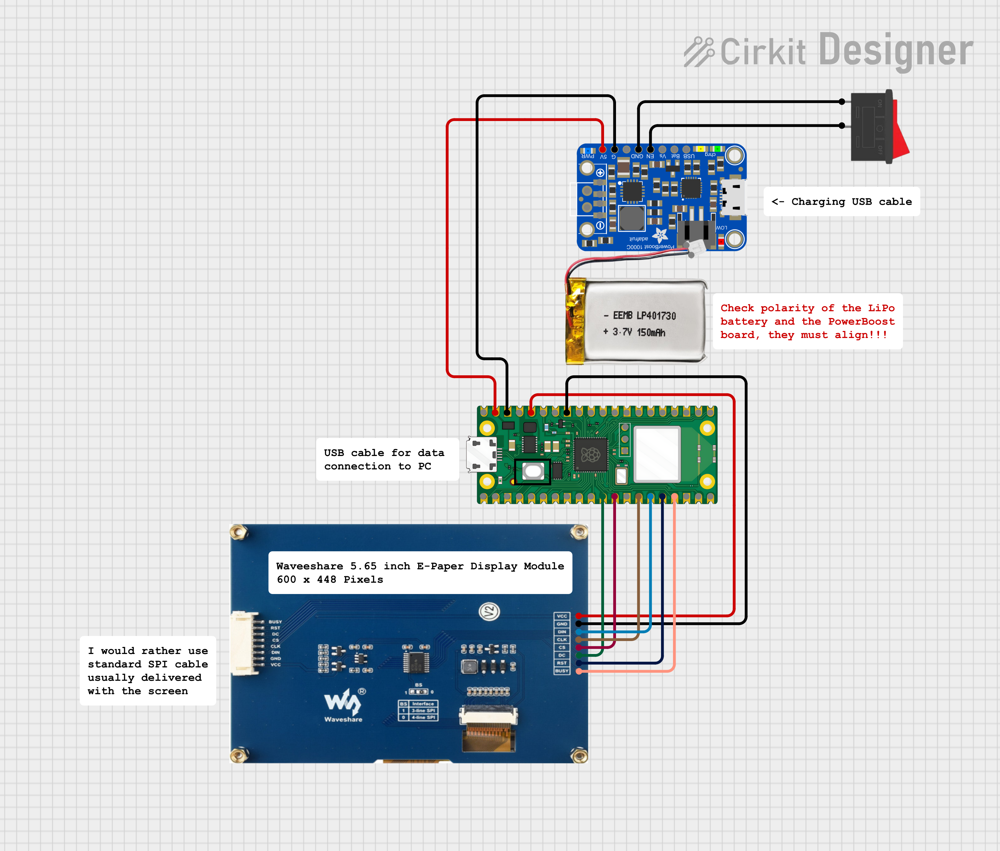

# MicroPython ePaper Weather Station

This project is a weather station built using MicroPython on a Raspberry Pi Pico W and a Waveshare 5.65-inch ePaper display. It fetches and displays weather data for a specified location.

## Screenshot
The device shows the weather data for Now, +4 hours, +8 hours, and tomorrow at 12:00. The small images are loaded from flash, the big image is fetched from my personal API. The reason the big images are in the API is because there is not enough storage on the flash. Feel free to use the api as is if you dont want to host your own.
<p align="left">
  
</p>

I have made a wallmount for the weatherstation, that can be 3D-printed.  
The wallmount can be downloaded here: [**fran on MakerWorld**](https://makerworld.com/en/models/1773343-wallmount-for-waveshare-pico-e-paper-5-65#profileId-1888240)  
<p align="left">
  
</p>

## Features
- **Weather Data**: Retrieves weather data from the MET Weather API.
- **ePaper Display**: Utilizes a Waveshare 5.65-inch ePaper display to display weather updates.
- **Wi-Fi Connectivity**: Connects to Wi-Fi to fetch the latest weather information.
- **Real-Time Updates**: Updates weather data and display in real-time.
- **Customizable Location**: Easily set your location to get accurate weather data.

## Components
- **MicroPython**: The project is written in MicroPython.
- **Raspberry Pi Pico 2 W**: The microcontroller used for this project.
- **Waveshare 5.65-inch ePaper Display**: The display used to show weather data.

## Getting Started
### Prerequisites
- Raspberry Pi Pico 2 W
- Waveshare 5.65-inch ePaper display
- MicroPython firmware installed on the Pico W
- Wi-Fi network

### Assembly

The following schematic shows how to wire the display. The central unit is the <b>Raspberry Pi Pico 2 W</b>, which communicates with the display over the SPI interface. This project uses the <b>Waveshare 5.65‑inch E‑Paper Display Module</b> with a resolution of 600 × 448 pixels; other Waveshare E‑Paper displays can also be used, but the software configuration (for instance resolution) must be adapted accordingly. The module is usually supplied with an SPI data cable (PH2.0, 20 cm, 8‑pin, 1×), which can be used to connect the display directly to the Raspberry Pi Pico’s SPI pins, plus power (3.3 V) and ground. To reduce the number of loose cables and provide battery operation, the Adafruit PowerBoost 1000C can be included to handle power management and 5 V boost conversion. It is powered by a standard single‑cell 3.7 V LiPo battery and can charge the battery via its micro‑USB connector while the system is running.

<p style="color: red;">Always verify the polarity of both the LiPo battery and the PowerBoost 1000C before making any connection. The PowerBoost 1000C uses a non‑standard battery polarity; reversing the polarity can permanently damage the battery, the PowerBoost 1000C, and potentially the rest of the circuit!</p>

<p align="left">
  
</p>

When the battery is low, it can be recharged while the main display continues to operate. Unfortunately, the status LEDs are located on the back of the display module, so they are not easily visible during normal use. To switch the device on and off, briefly short the <b>EN pin</b> to the adjacent <b>GND pin</b> on the PowerBoost 1000C using a standard momentary or latching switch; this will enable or disable the output of the power module. When these two pins are connected, the PowerBoost 1000C output is latched off and the device is powered down, and it will turn back on once EN is released. Because pulling EN low turns the device off, the switch operates with inverted logic (pressed = off, released = on), and if no switch is installed the device will remain permanently on as long as power is available.

### Installation
1. **Clone the Repository**:  
   ```sh
   git clone https://github.com/frederik-andersen/micropython-ePaperWeatherStation.git
    ```
2. **Set Up Wi-Fi Credentials**:  
Open datafetcher.py and replace the placeholders with your actual Wi-Fi SSID and password:
    ```
    _SSID = "WIFI_SSID_PLACEHOLDER"
    _WIFI_TOKEN = "WIFI_PASSWORD_PLACEHOLDER"
    ```
3. **Change header for MET API**:  
Open datafetcher.py and replace the placeholder with your email. This is required by MET API.
    ```
    self.USER_AGENT_HEADER = {'User-Agent': 'pico-ePaper-weather-station v.1.0.0 PLACEHOLDER@PLACEHOLDER.com'}
    ```
4. **Add your location**:  
   - Default location is "drammen".
   - Go get the latitude, longitude and altitude for the place you want weather data.
   - Add your location to the locations dictionary in DataFetcher.
     ```python
     self.locations = {
         'drammen': {'latitude': 59.7396, 'longitude': 10.2046, 'altitude': 3},
         'oslo': {'latitude': 59.9108, 'longitude': 10.7577, 'altitude': 4}
     }
     ```
5. **Input correct location in main.py**:  
In main.py input the new location to DataFetcher.
    ```python
    data = DataFetcher('drammen')
    ```

6. **Optional: Translate to your language**:  
   The code is in English, but in ScreenManager the text is in Norwegian.
   Text to be translated:
  -  "Nå" -> "Now"
  -  "i morgen" -> "tomorrow"
  -  "Sist oppdatert" -> "Last update"
   
7. **Optional: Run your own api**:  
  - The code uses my API to store large images.
  - If you want other images than mine, you should run your own API. See the flask_api folder and run it on pythonanywhere.com.

8. **Upload the Code to Pico W**:
  - Use a tool like Thonny or rshell to upload the code to your Raspberry Pi Pico 2 W.
  - Do not upload the screenshots and flask_api directories.


### Usage
1. **Power On the Pico W**:
   - Connect your Raspberry Pi Pico W to a power source.

2. **View Weather Data**:
   - The ePaper display will show the current weather data for your specified location. The data is updated every hour, and the screen is cleared once every 24 hours at 02:00 UTC to prevent ghosting.

## TODO:
- Handling wintertime and summertime. Wintertime is now hardcoded in TimeManager.

## Assembly

<p align="left">
  
</p>

TODO: Write here a more precise tutorial.


## Modifications and new libraries:
- The ePaper [driver](https://github.com/frederik-andersen/micropython-ePaper-5in65-border-color "New epaper driver") is changed so border color can be changed, and the buffer is allocated outside the class. This is to prevent memory leaks that happend with the original driver.

- EasyWriter is a library written by me to make it easier to add text and binary images to the screen.

- [Image to byte array](https://github.com/frederik-andersen/python-image_to_bytearray "Image to byte array") is used to convert ditered png files to binaries.
- [New epaper driver](https://github.com/frederik-andersen/micropython-ePaper-5in65-border-color "New epaper driver") is used to set the border color

## Contributing
Contributions are welcome! Please feel free to submit a Pull Request.

## License
This project is licensed under the MIT License - see the LICENSE file for details.

## Acknowledgements
- [**Peter Hinch**](https://github.com/peterhinch "PeterHinch"): For the writer class used for text rendering and font_to_py for fonts.
- [**Waveshare**](https://github.com/waveshareteam/e-Paper "Waveshare"): For the ePaper display and driver.
- [**Christopher Arndt**](https://github.com/SpotlightKid/mrequests "Christopher Arndt"): For mrequests. A better requests library.
- [**MET Weather API**](https://api.met.no/weatherapi/locationforecast/2.0/documentation "MET Weather API"): The weather api used for all data.
- [**MET Weather API icons**](https://github.com/metno/weathericons "MET Weather API icons"): For the weather images.
- [**Pythonanywhere**](https://www.pythonanywhere.com/ "Pythonanywhere"): For free python flask hosting.
